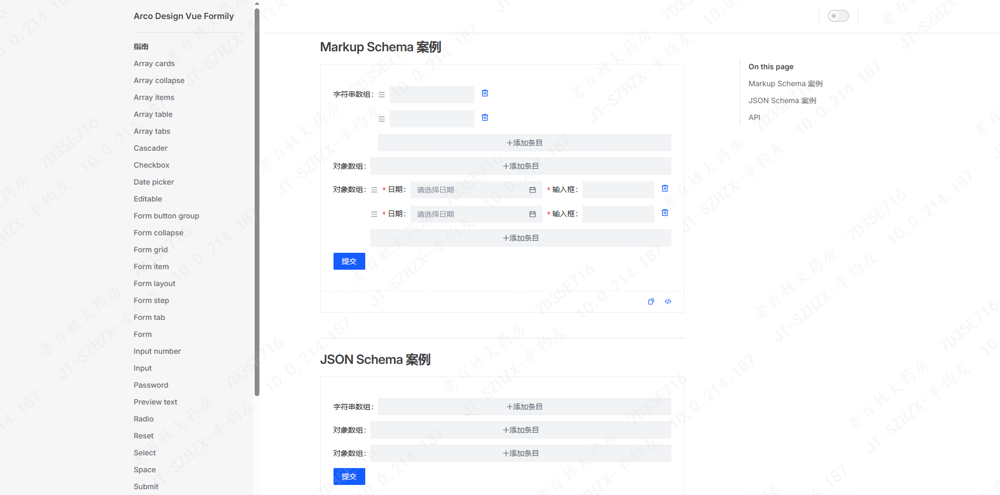

<p align="center">
  
  <!-- 
   -->
  <a href="https://www.npmjs.com/package/@formily/antdv-x3"></a>
  <a href="https://codecov.io/gh/formilyjs/antdv-x3">
    
  </a>
  
  <a href="https://github.com/actions-cool/issues-helper">
    
  </a>
</p>

---

## 概要

这是一个结合了 Formily & @arco-design/web-vue & Vue3 的超酷组件库. 与官方版本 antd 适配库保持一致性适配。



## 特性

- 🖼 可设计，借助 Form Builder 可以快速搭建表单
- 🚀 高性能，字段分布式渲染，大大减轻 React 渲染压力
- 💡 支持 Ant Design/Fusion Next 组件体系
- 🎨 JSX 标签化写法/JSON Schema 数据驱动方案无缝迁移过渡
- 🏅 副作用逻辑独立管理，涵盖各种复杂联动校验逻辑
- 🌯 支持各种表单复杂布局方案

## 安装使用

```
$ npm install --save @arco-design/web-vue
$ npm install --save @formily/core @formily/vue vue arco-design-web-vue-formily
```

